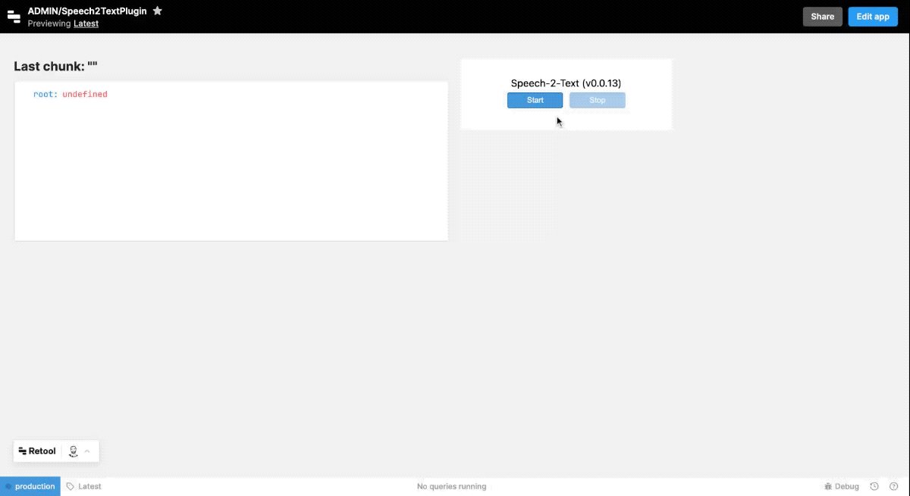

# Speech to Text for Retool

A Custom Component for Retool that adds **Speech to Text** capability.



> [!NOTE]
>
> It requires, only the first time, the permission from the browser to use the microphone.

> [!WARNING]
>
> Please refer to the  [official documentation](https://developer.mozilla.org/en-US/docs/Web/API/SpeechRecognition) of the **SpeechRecognition** capability about browsers compatibility and different implementations between vendors. We've only tested successfully on Google Chrome.

## Installation

Drag a Custom Component into your canvas in a Retool app.

Put this code into the `IFrame Code` area of the Custom Component:

```html
<script src="https://unpkg.com/@eloquentops/retool-plugin-speech2text"></script>
```

Allow the following checkbox in the `interaction` section of the Custom Component:
- [x] Microphone
- [x] Storage and cookies


## Configuration

You can add options in the `Model` such this example (values are the default). 

> [!IMPORTANT]
>
> An empty object `{}` is required! Do not leave empty.

```js
{
    lang: 'en-US',
    continuous: false,
    interimResults: true,
    maxAlternatives: 1,
    keepActive: true
}
```

Please refer to this [official documentation](https://developer.mozilla.org/en-US/docs/Web/API/SpeechRecognition) about the `SpeechRecognition` options.

`keepActive` is a custom option that force the restart of the speech in case of silence. Otherwise the `SpeechRecognition` will close automatically after few seconds of silence.

> [!IMPORTANT]
>
> Right now, when you change an option in the Model, you need to reload the component, because `SpeechRecognition` cannot be reset at runtime. 

## How to get back the text

Fair question. The component exposes two additional properties in its model:

```js
{
  lastMessage: '', // String
  messages: [] // Array of strings
}
```

So, you can bind them to your Retool component as usual you do with Retool components, such as:

```
Last message: {{customComponent2.model?.lastMessage}}
```

## Licence

This plugin is released under the [3-Clause BSD license](LICENSE).

Copyright © 2023 Fabio Franchino, [https://fabiofranchino.com](https://fabiofranchino.com)